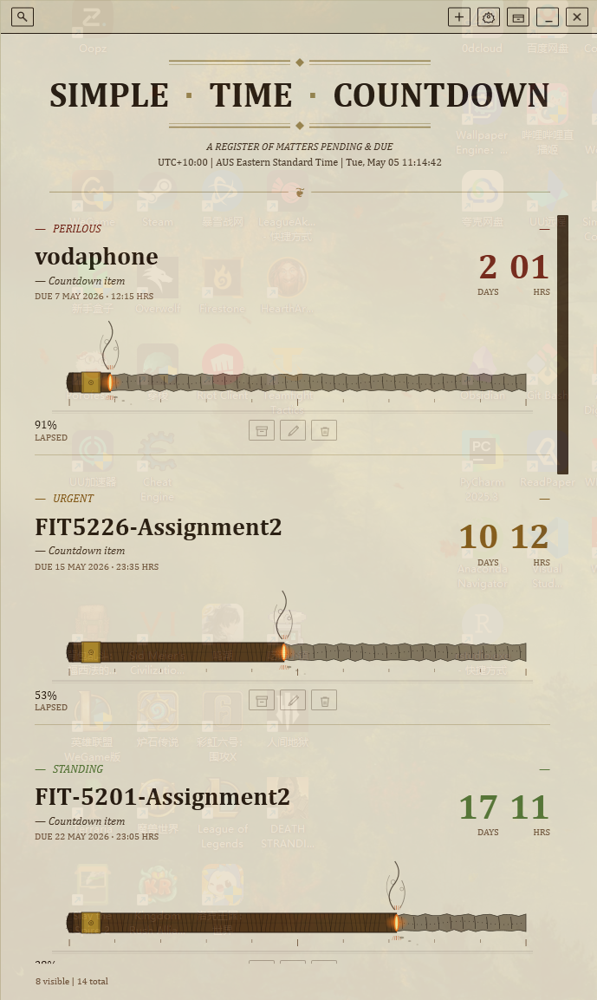
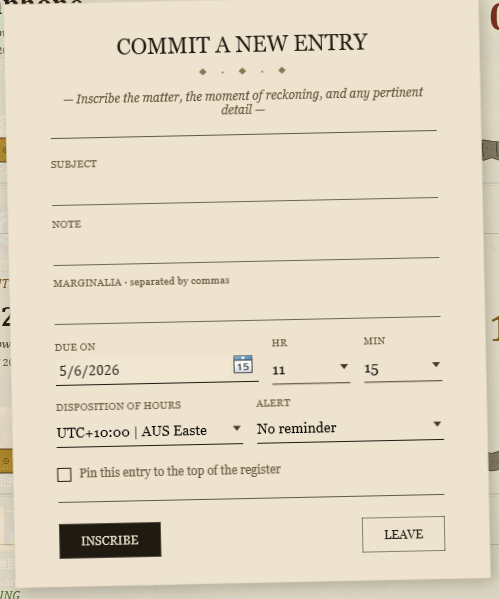
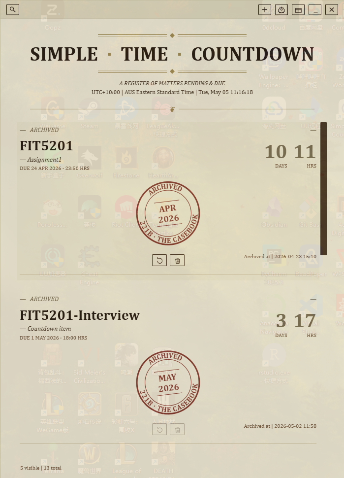
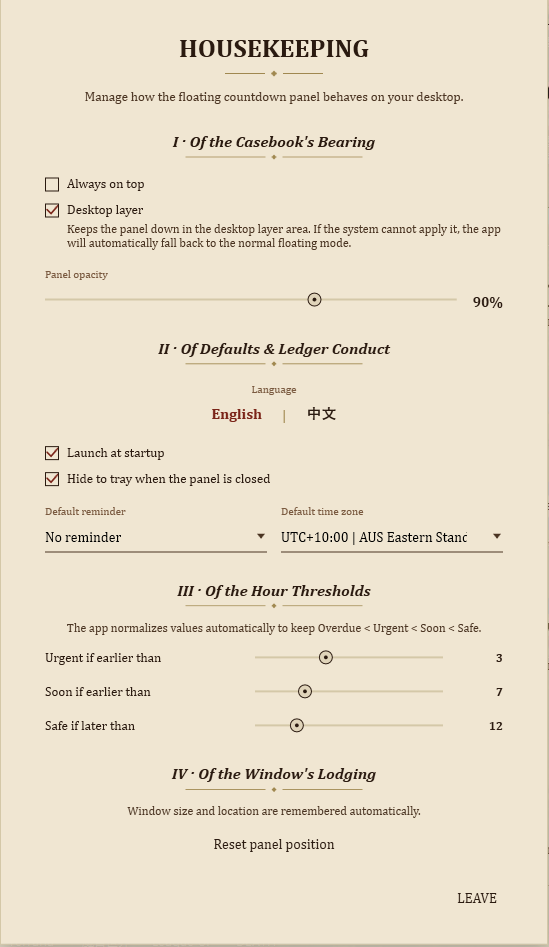

# Simple Time Countdown

<div align="center">

[**English**](README.md) | [**简体中文**](README.zh-CN.md)

</div>

A lightweight floating countdown app for Windows 11, built with WPF and .NET 8.









## Why this project

Simple Time Countdown is designed around three product goals:

- Lightweight: desktop-native WPF app, no browser runtime, no Electron-style memory overhead
- Low resource usage: local JSON storage, no background sync service, and a small always-available footprint
- Distinctive look: a single parchment "casebook" panel with floating cards, treated as printed matter rather than a stack of UI widgets

## Repository structure

- `.github/workflows/` — CI for Windows builds
- `docs/images/` — screenshots and visual references
- `packaging/msix/` — MSIX manifest and packaging assets
- `scripts/` — asset generation, publish, and install scripts
- `src/SimpleTimeCountdown.App/` — WPF desktop app
  - `Themes/VictorianTheme.xaml` — palette, fonts, and shared control styles
  - `Controls/CigarCountdown.cs` — custom-drawn cigar-shaped progress bar
  - `Converters/`, `Models/`, `Services/`, `ViewModels/`, `Views/`, `Assets/`
- `src/SimpleTimeCountdown.Setup/` — branded installer
- `artifacts/` — generated output only, not committed

## Features

### Behaviour and integration
- Multilingual UI (English / Simplified Chinese), switchable at runtime
- Search and filter by title, note, or marginalia tags (toggle the magnifier in the chrome bar)
- Drag the panel from any non-interactive area
- Local JSON persistence under `%AppData%\TimeCountdown\state.json`
- Tray icon: show panel, add countdown, settings, always-on-top toggle, exit
- Registry-based launch at startup
- Reminder balloons and due notifications

## Build

All commands below assume the current directory is the repository root.

1. Install the .NET 8 SDK with Windows desktop support.
2. Open `SimpleTimeCountdown.sln` in Visual Studio 2022, or use PowerShell from the repository root.
3. Restore and build the solution:

```powershell
dotnet restore .\SimpleTimeCountdown.sln
dotnet build .\SimpleTimeCountdown.sln
```

Build the Release configuration:

```powershell
dotnet build .\SimpleTimeCountdown.sln -c Release
```

Run the WPF app from source:

```powershell
dotnet run --project .\src\SimpleTimeCountdown.App\SimpleTimeCountdown.App.csproj
```

Run the installer project from the Debug build output:

```powershell
dotnet run --project .\src\SimpleTimeCountdown.Setup\SimpleTimeCountdown.Setup.csproj
```

`dotnet build` only updates the project build outputs under `src/**/bin/`. It does not update the distributable packages under `artifacts/packages/`. To update the classic installer EXE that users download or double-click, run the `Build-SetupExe.ps1` command in the Publish section.

## Publish

All publish scripts default to `Release` and `win-x64`. You can override them with `-Configuration` and `-RuntimeIdentifier`, for example:

```powershell
powershell -ExecutionPolicy Bypass -File .\scripts\Build-SetupExe.ps1 -Configuration Release -RuntimeIdentifier win-x64
```

Portable zip:

```powershell
powershell -ExecutionPolicy Bypass -File .\scripts\Publish-Portable.ps1
```

MSIX package:

```powershell
powershell -ExecutionPolicy Bypass -File .\scripts\Publish-MSIX.ps1
```

Install the generated MSIX locally:

```powershell
powershell -ExecutionPolicy Bypass -File .\scripts\Install-MSIX.ps1
```

For the first install of the self-signed development package, Windows may require running the install step from an elevated PowerShell so the certificate can be trusted at the machine level.

Classic `Setup.exe` installer:

```powershell
powershell -ExecutionPolicy Bypass -File .\scripts\Build-SetupExe.ps1
```

This command first publishes the portable app, embeds that portable zip into the setup project, then writes the signed installer to `artifacts/packages/SimpleTimeCountdown-Setup-win-x64.exe`.

Outputs (relative to the repository root):

- Portable zip: `artifacts/packages/SimpleTimeCountdown-Release-win-x64-portable.zip`
- Setup EXE: `artifacts/packages/SimpleTimeCountdown-Setup-win-x64.exe`
- MSIX: `artifacts/packages/SimpleTimeCountdown_<version>_win-x64.msix`
- Dev certificate: `artifacts/certificates/TimeCountdownDev.cer`

## Download

Get the latest version from this repository's GitHub Releases page:

- Latest release: [Releases / Latest](../../releases/latest)
- All versions: [Releases](../../releases)

Package differences:

- `SimpleTimeCountdown-Setup-win-x64.exe` (recommended for most users)
  - Standard installer experience
  - Creates Start menu and desktop entries plus an uninstall entry
  - Best for one-click install and normal daily use
- `SimpleTimeCountdown-Release-win-x64-portable.zip`
  - No installer; unzip and run directly
  - No system-level install or uninstall registration
  - Best for USB drive, temporary use, or restricted environments
- `SimpleTimeCountdown_*.msix`
  - MSIX package model with cleaner install and uninstall isolation
  - Better managed by Windows package infrastructure
  - Best for users who prefer MSIX deployment workflows
