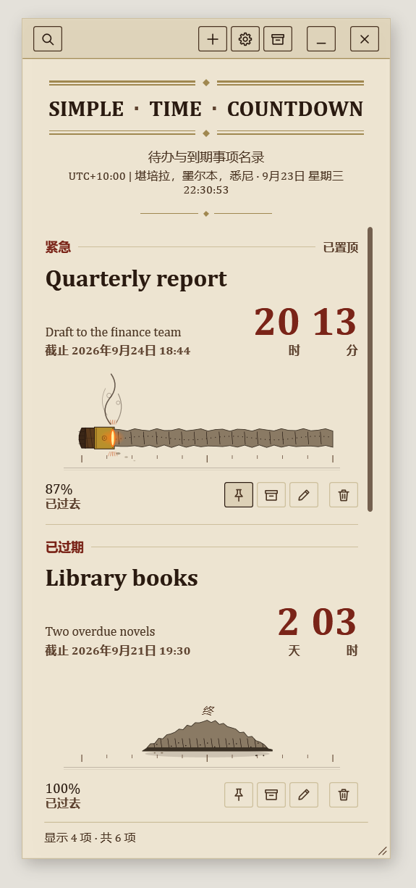
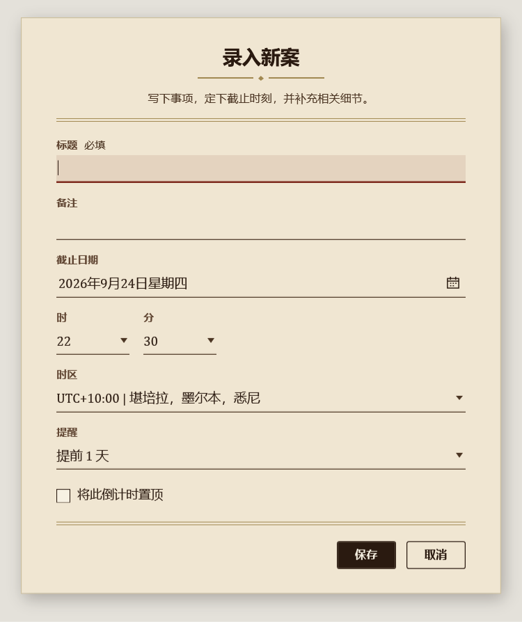
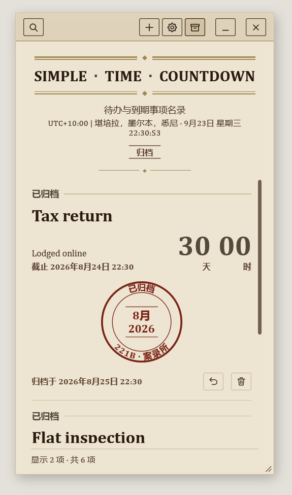
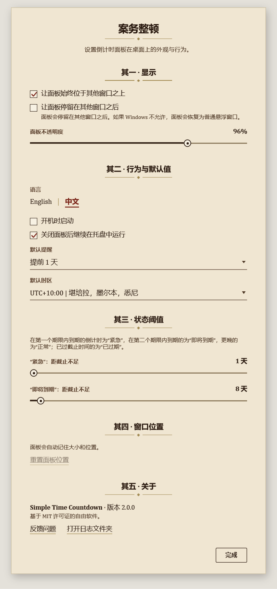

# Simple Time Countdown

<div align="center">

[**English**](README.md) | [**简体中文**](README.zh-CN.md)

</div>

让每个截止日期都在眼前。Simple Time Countdown 是一块悬浮在 Windows 桌面上的小巧倒计时面板，随时告诉你每件事还剩多少时间：考试、作业提交、账单、出行、生日……



- **轻巧不占资源**：原生 Windows 应用，不内嵌浏览器，没有后台服务。
- **注重隐私**：所有数据只保存在你的电脑上。无需账号，不同步、不追踪、不联网。
- **风格独特**：整块面板是一张羊皮纸“案录”，每条倒计时都像一则印刷条目。

适用于 Windows 10（2004 或更高版本）和 Windows 11，支持简体中文和英文界面。

## 下载与安装

请到 [Releases 页面](../../releases/latest)下载最新版本（[全部版本](../../releases)）。无需事先安装任何其他组件。

| 文件 | 适合的情况 |
| --- | --- |
| `SimpleTimeCountdown-Setup-win-x64.exe` | **推荐。** 希望正常安装，获得开始菜单和桌面快捷方式，并能在“设置 > 应用”中卸载。无需管理员权限。 |
| `SimpleTimeCountdown-Release-win-x64-portable.zip` | 不想安装任何东西：解压到任意位置（包括 U 盘），运行 `TimeCountdown.exe` 即可。 |
| `SimpleTimeCountdown_<version>_win-x64.msix` | 希望由 Windows 自带的应用包系统来安装和卸载。只有使用你的电脑信任的证书签名时，才能双击直接安装。 |

安装时运行 Setup 文件，按提示操作即可。默认只为当前用户安装，位置是 `%LocalAppData%\Programs\Simple Time Countdown`；你也可以选择其他文件夹，决定是否创建桌面快捷方式、安装完成后是否立即启动。安装程序会根据 Windows 的显示语言使用中文或英文。在旧版本上安装新版本时，你的倒计时会保留。

## 使用方法

### 新建倒计时

点击面板顶部栏的 **+**（或按 `Ctrl+N`），然后填写：

- **标题**（必填，最多 120 字）。卡片上总会完整显示标题，较长的标题只会略微缩小字号。
- **备注**（可选，最多 280 字），例如房间号或需要带的东西。
- **截止日期**、**时**、**分**，以及所在**时区**。如果所选时间因夏令时切换而不存在或出现两次，表单会提示你。
- **提醒**：不提醒，或提前 15 分钟、1 小时、1 天、3 天。
- 勾选**置顶**，让它始终排在列表最前面。



### 看懂一张卡片

- 顶部的标签显示状态：随着截止时间临近依次为**正常**、**即将到期**、**紧急**（具体何时变化可在设置中调整），过了截止时间则为**已过期**。
- 大号数字显示剩余时间（先是天和小时，然后是小时和分钟，最后是分钟和秒）；过了截止时间后，显示已经过去了多久。
- 燃烧的雪茄表示从创建这条倒计时到现在，时间已经过去了多少；到期后只剩下一堆灰烬。
- 每张卡片下方的按钮可以置顶或取消置顶、归档、编辑和删除。

### 归档、恢复与搜索

- 已完成的倒计时可以归档，归档后会盖上一枚邮戳。用顶部栏的归档按钮（或 `Ctrl+E`）在进行中列表和归档之间切换；归档的倒计时随时可以恢复。
- 点击放大镜（或按 `Ctrl+F`）搜索标题和备注。按一次 `Esc` 清除搜索内容，再按一次关闭搜索栏。



### 提醒

到了提醒时间以及到达截止时间时，你会收到 Windows 通知，点击通知即可打开面板。电脑关机或应用未运行期间错过的提醒，会在下次启动时合并显示。通知遵循 Windows 的通知设置（包括“专注”/“请勿打扰”）。

### 键盘快捷键

| 快捷键 | 功能 |
| --- | --- |
| `Ctrl+N` | 新建倒计时 |
| `Ctrl+F` | 搜索 |
| `Esc` | 清除搜索内容，再按一次关闭搜索栏 |
| `Ctrl+E` | 显示或隐藏归档 |
| `Ctrl+,` | 设置 |

### 面板与托盘图标

- 在面板的空白处按住即可拖动，拖动边缘或右下角可调整大小；面板会记住大小和位置。
- 单击任务栏通知区域（托盘）的图标即可打开面板。右键菜单包括：显示面板、新建倒计时、设置、始终置顶、卸载（Setup 安装版）和退出。
- 面板的关闭按钮可以设为“继续在托盘中运行”（提醒照常弹出）或“直接退出”，在设置中选择。要彻底退出，请使用托盘菜单中的**退出**。

## 设置

点击顶部栏的齿轮按钮（或按 `Ctrl+,`）打开设置，所有更改立即生效。

- **显示**：让面板始终位于其他窗口之上，或让它停留在其他窗口之后；面板不透明度（85%–100%）。
- **行为与默认值**：界面语言（English / 中文）、登录 Windows 时自动启动、关闭面板后继续在托盘中运行，以及新建倒计时默认使用的提醒和时区。
- **状态阈值**：距截止还有多久时，倒计时算作“紧急”或“即将到期”。
- **窗口位置**：把面板放回默认位置。
- **关于**：版本号、反馈问题的链接，以及打开日志文件夹的按钮。



## 无障碍

- 所有操作都可以用键盘完成，并有清晰可见的焦点框。
- 屏幕阅读器会读出每条倒计时的一句话概要和每个按钮的名称；雪茄进度以百分比读出。
- 支持 Windows 对比度主题：应用会改用系统配色，并关闭半透明和阴影效果。
- 遵循 Windows 的“文本大小”设置（设置 > 辅助功能 > 文本大小）；面板拉宽时，文字也会随之变大。
- 即使面板不透明度调到最低，文字颜色对比度也满足 WCAG AA 标准。

## 数据与隐私

- 倒计时和设置保存在你电脑上的 `%AppData%\TimeCountdown\state.json`，并以 `state.json.bak` 保留上一份完好的副本。
- 万一该文件无法读取，应用会恢复上一份完好的副本，把无法读取的文件另存为 `state.corrupt.<日期时间>.json`（不会丢失任何内容），并告诉你它的位置。
- 诊断日志（便于反馈问题）保存在 `%LocalAppData%\TimeCountdown\logs`，只保留最近 7 天。**设置 > 关于 > 打开日志文件夹**可直接打开它。
- MSIX 版会把这两个文件夹放在自己的私有存储中，位于 `%LocalAppData%\Packages\SimpleTimeCountdown.Desktop_<id>\` 下。

## 卸载

- **Setup 安装版**：在“设置 > 应用”中卸载，或使用托盘菜单中的**卸载**。你可以选择同时删除倒计时、设置和日志；不勾选则会保留，便于日后重新安装。
- **便携版**：退出应用后删除其文件夹即可。倒计时数据仍保留在 `%AppData%\TimeCountdown`，如不再需要也可一并删除。
- **MSIX 版**：在“设置 > 应用”中卸载，Windows 会同时删除应用的数据。

## 常见问题

- **面板不见了。** 单击托盘图标。如果面板跑到了屏幕外（例如拔掉了一台显示器），打开设置，选择**重置面板位置**。
- **按 Win+D 后面板消失了。** 开启“让面板停留在其他窗口之后”时，“显示桌面”也会把它隐藏。单击托盘图标即可找回。
- **收不到提醒。** 请确认这条倒计时设置了提醒、应用仍在托盘中运行，并且 Windows 通知（以及“专注”/“请勿打扰”）允许显示通知。
- **出现了问题。** 请通过**设置 > 关于 > 反馈问题**告诉我们，并附上**打开日志文件夹**中最新的日志文件。

---

## 开发者指南

### 从源码构建

前提条件：

- Windows 10（2004 或更高版本）或 Windows 11
- .NET SDK 8.0.419 或更高的 8.0.4xx 补丁版本；[global.json](global.json) 固定了该版本，在仓库根目录运行 `dotnet --version` 必须成功
- 可选：安装了“.NET 桌面开发”工作负载的 Visual Studio 2022
- 仅在构建 MSIX 或签名时需要：Windows 10/11 SDK（`makeappx`、`makepri`、`signtool`）

以下命令均在仓库根目录执行：

```powershell
dotnet restore .\SimpleTimeCountdown.sln
dotnet build .\SimpleTimeCountdown.sln -c Release
dotnet test .\SimpleTimeCountdown.sln -c Release --no-build
dotnet run --project .\src\SimpleTimeCountdown.App\SimpleTimeCountdown.App.csproj
```

`dotnet build` 只会更新 `src/**/bin/` 下的构建输出，不会生成用于分发的安装包；请使用下文的发布脚本。

安装器项目（`src/SimpleTimeCountdown.Setup`）只有在 `Build-SetupExe.ps1` 发布它时才会带上安装载荷，因此通过 `dotnet run` 或 Visual Studio 启动的 Setup 无法安装任何内容（但加上 `--uninstall` 时，它仍会卸载当前用户已安装的副本）。脚本生成的 `Setup.exe` 会真正执行按用户安装（文件写入 `%LocalAppData%\Programs`，并创建快捷方式和“设置 > 应用”中的卸载项）：请在虚拟机中试用，或试用后在“设置 > 应用”中卸载。

### 发布脚本

请使用 Windows PowerShell 5.1（即示例中的 `powershell.exe`）运行这些脚本，它们正是针对该版本编写和测试的。默认使用 `Release` 和 `win-x64`（可用 `-Configuration` 和 `-RuntimeIdentifier win-x64|win-x86|win-arm64` 覆盖）；每次都会清空并重建输出目录，确保不会带上过期文件；任何一步失败都会立即停止。

```powershell
# 便携包
powershell -ExecutionPolicy Bypass -File .\scripts\Publish-Portable.ps1

# 便携包 + 经典 Setup.exe 安装器（便携 zip 会作为安装载荷嵌入安装器）
powershell -ExecutionPolicy Bypass -File .\scripts\Build-SetupExe.ps1

# MSIX 包，使用本机开发证书签名（仅供在本机测试）
powershell -ExecutionPolicy Bypass -File .\scripts\Publish-MSIX.ps1 -DevCertificate
```

输出位置（相对仓库根目录）：

- 便携包：`artifacts/packages/SimpleTimeCountdown-Release-win-x64-portable.zip`
- 安装包：`artifacts/packages/SimpleTimeCountdown-Setup-win-x64.exe`
- MSIX：`artifacts/packages/SimpleTimeCountdown_<version>_win-x64.msix`
- 调试符号（不会打进安装包）：`artifacts/symbols/<configuration>/<rid>/<package>/`，例如 `artifacts/symbols/Release/win-x64/portable/`

每个安装包只有在完整生成、并且（配置了证书时）签名完成之后，才会移入 `artifacts/packages`；因此运行失败时，那里不会留下不完整或漏签名的安装包。未配置证书时，输出为未签名版本，脚本会给出提示；签名选项的说明见 `scripts/ReleaseCommon.ps1`。

`Test-SetupExe.ps1` 用于对 `Build-SetupExe.ps1` 生成的 `Setup.exe` 做冒烟测试：静默安装、在其上重新安装，再通过“设置 > 应用”使用的卸载命令静默卸载，每一步之后都会检查文件、快捷方式和注册表。它会为当前用户真正安装本应用，因此 CI 在全新的运行器上执行它；在本地请使用虚拟机。如果当前用户已经安装了 Simple Time Countdown，脚本会拒绝运行。

```powershell
powershell -ExecutionPolicy Bypass -File .\scripts\Test-SetupExe.ps1
```

### 仓库结构

- `.github/workflows/`：CI（构建、测试、生成三种安装包，以及 Setup.exe 的安装/卸载测试）
- `docs/images/`：README 截图
- `packaging/msix/`：MSIX 清单模板与图标
- `scripts/`：发布脚本（便携包、Setup.exe、MSIX、签名）、Setup.exe 冒烟测试和图标生成脚本
- `src/Shared/`：主程序与安装器必须一致的名称
- `src/SimpleTimeCountdown.App/`：WPF 主程序
  - `Themes/VictorianTheme.xaml`：“案录”设计语言，包括配色、字体和公共控件样式
  - `Controls/`：自绘部件，如雪茄形进度条、归档邮戳和卡片标题
  - `Services/`：状态保存、本地化、主题与高对比度、日志、开机自启
  - `Models/`、`ViewModels/`、`Views/`、`Converters/`
  - `Assets/`：图标源文件（`AppIcon.svg`）、其 PNG 导出图和 `AppIcon.ico`
- `src/SimpleTimeCountdown.Setup/`：Setup.exe 安装器
- `tests/`：自动化测试
- `artifacts/`：构建输出目录，不提交

### 参与贡献与许可证

请参阅 [CONTRIBUTING.md](CONTRIBUTING.md)。Simple Time Countdown 以 [MIT 许可证](LICENSE) 发布；安装包中还再分发了 .NET 运行时，详见 [THIRD-PARTY-NOTICES.md](THIRD-PARTY-NOTICES.md)。
